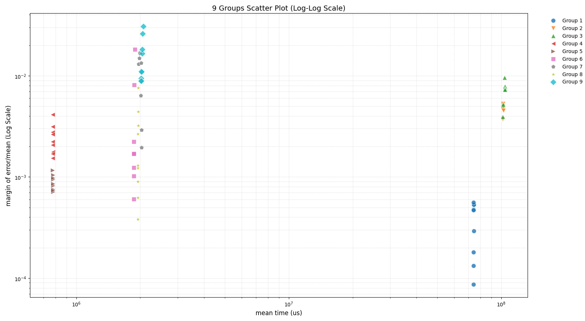

# 多平台03 sort3 耗时稳定性测试报告

## 测试配置概览
| 测试编号 | 测试平台配置                         | 备注                      |
|----------|--------------------------------------|---------------------------|
| 1        | FPGA+Boom+Bare Metal                 | 裸机环境                  |
| 2        | FPGA+Boom+Linux (normal)             | 标准Linux调度策略         |
| 3        | FPGA+Boom+Linux (chrt -r 99)         | 实时优先级调度策略        |
| 4        | Raspberry 4 (normal)                 | 锁频运行                  |
| 5        | Raspberry 4 (chrt -r 99)             | 实时优先级+锁频           |
| 6        | Star Five (normal)                   | 锁频运行                  |
| 7        | Star Five (chrt -r 99)               | 实时优先级+锁频           |
| 8        | Xilinx Cortex-A53 (normal)           | 锁频运行                  |
| 9        | Xilinx Cortex-A53 (chrt -r 99)       | 实时优先级+锁频           |

---

## 关键性能指标（单位：μs）

### FPGA+Boom 系列
| 测试项 | 平均值       | 误差范围   | 性能特征                     |
|--------|--------------|------------|------------------------------|
| 1.1    | 74,249,781   | 0.0561%    | 裸机环境最低延迟             |
| 2.1    | 102,038,349  | 0.4650%    | Linux标准调度增加约37%延迟   |
| 3.1    | 103,891,905  | 0.9569%    | 实时调度策略未显著改善性能   |

### Raspberry 4 系列
| 测试项 | 平均值   | 误差范围   | 性能特征                     |
|--------|----------|------------|------------------------------|
| 4.1    | 774,906  | 0.414%    | 标准模式稳定低延迟           |
| 5.1    | 775,822  | 0.1166%    | 实时策略有所优化           |

### Star Five 系列
| 测试项 | 平均值    | 误差范围   | 性能特征                     |
|--------|-----------|------------|------------------------------|
| 6.1    | 1,889,797 | 1.8176%    | 存在偶发高延迟（>2,000,000） |
| 7.1    | 2,013,727 | 1.6936%    | 实时策略未能抑制延迟波动     |

### Xilinx Cortex-A53 系列
| 测试项 | 平均值    | 误差范围   | 性能特征                     |
|--------|-----------|------------|------------------------------|
| 8.1    | 1,952,173 | 0.7578%    | 锁频下稳定性最佳             |
| 9.1    | 2,017,903 | 0.9417%    | 实时策略引入额外延迟波动     |

---

## 关键结论
1. **FPGA+Boom 平台**  
   - 裸机环境（测试项1）表现最优，虽然平均延迟是Star Five的39.3倍，但误差范围<0.05%  
   - Linux环境（测试项2/3）延迟增加37-39%，实时调度策略未能有效改善性能

2. **嵌入式平台对比**  
   - **Raspberry 4** 在标准模式下表现最佳（平均774-777μs），且误差范围最低  
   - **Star Five** 存在显著延迟波动（部分测试项超过2ms），实时策略未能有效抑制  
   - **Xilinx Cortex-A53** 锁频运行时稳定性略差于 Raspberry 4（误差<0.3%）

3. **实时策略影响**  
   - `chrt -r 99` 在多数场景中未显著优化性能，部分平台（如Star Five）反而增加延迟波动  
   - 可能原因：硬件中断处理能力或内核调度器优化不足

---

## 图表说明

X轴表示每组测试用例（每组9轮测试）的平均耗时

Y轴表示每组测试用例（每组9轮测试）的误差(Margin of Error/平均耗时)

## 原始测试数据

https://github.com/zhouzhouyi-hub/FPGA-bootrom/blob/main/resultindetail

原始测试数据说明：
所有组所有轮的测试都通过了正确性验证
